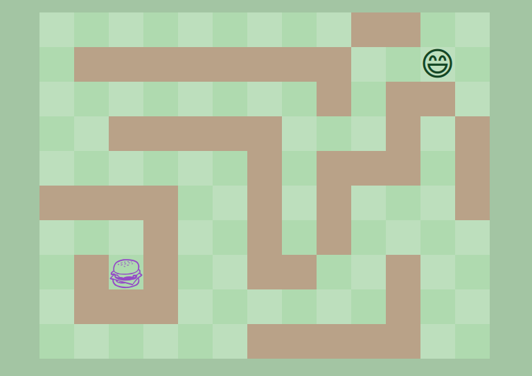

# Le burger mouvant !

Le but de cet exercice est de créer une grille d'après le modèle fourni. Sur cette grille doivent apparaître :

- un burger
- des murs
- un smiley intéressé par le burger

Sauf que le héros du jeu n'est pas le smiley, mais bien le burger :see_no_evil: Le but est de faire en sorte qu'on puisse déplacer le burger avec les flèches du clavier, jusqu'au smiley (qui pourra donc manger :miammiam:), sachant qu'on ne peut pas traverser les murs.

Une partie du JS et la totalité du CSS sont fournies, à vous de jouer !

## De quoi vous avez besoin ?

- L'event "keydown" permet d'écouter les appuis sur les touches du clavier. En exploitant `event.target`, vous pouvez connaître le code des touches appuyées.
- On peut localiser une case par ses coordonnées sur les axes X et Y de la grille !
- On peut changer la classe d'une case avec `case.classList.toggle(maclasse)` par exemple.

## Le résultat attendu

